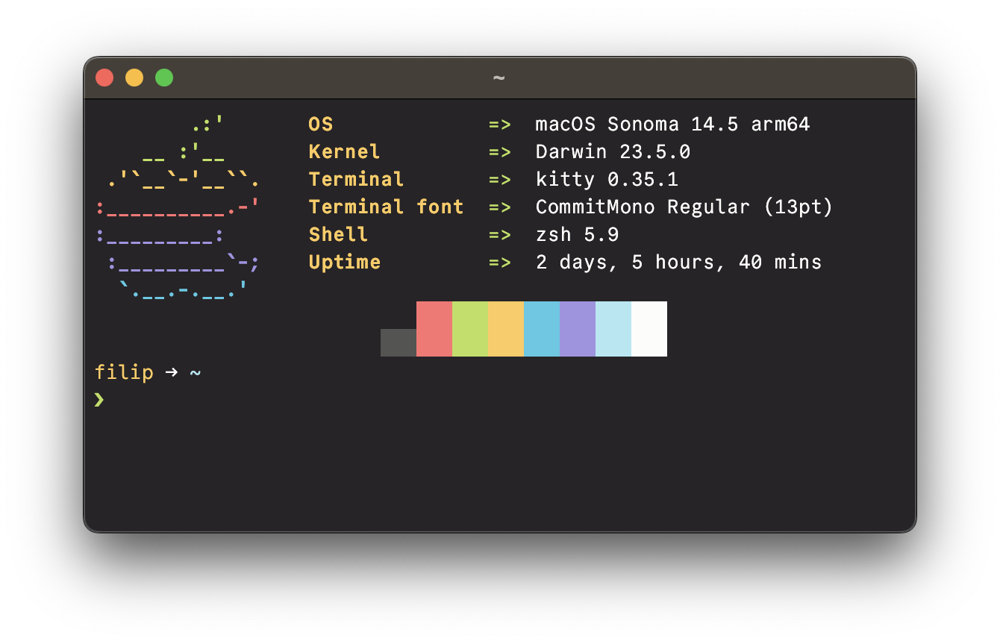

# 0x96f Terminal Theme

A simple and pleasant dark terminal theme

> [!NOTE]
> This theme is officially included in [mbadolato/iTerm2-Color-Schemes](https://github.com/mbadolato/iTerm2-Color-Schemes).

## Screenshot



## [Ghostty](https://ghostty.org/)

1. Download and move `ghostty/0x96f` to `~/.config/ghostty/themes`.
2. Open `~/.config/ghostty/config` and set the theme by adding `theme = 0x96f`.
3. Restart ghostty or reload the config to apply the changes.

## [Kitty](https://sw.kovidgoyal.net/kitty/)

1. Download and move `kitty/0x96f.conf` to `~/.config/kitty`.
2. Open `~/.config/kitty/kitty.conf` and import the theme by adding `include ./0x96f.conf`.
3. Restart kitty to apply the changes.

## [Alacritty](https://alacritty.org/)

1. Download and move `alacritty/0x96f.conf` to `~/.config/alacritty/themes`.
2. Open your `alacritty.toml` and import the theme in with the following:

```
import = [
    "~/.config/alacritty/themes/0x96f.toml"
]
```

3. Restart alacritty to apply the changes.

## [Wezterm](https://wezfurlong.org/wezterm/)

1. Download and move `wezterm/0x96f.lua` to `~/.config/wezterm/colors`.
2. Open your `wezterm.lua` and import the theme in with the following:

```
local wezterm = require 'wezterm'
local theme = require 'colors.0x96f'
local config = {}

config.colors = theme

return config
```

## [Warp Terminal](https://www.warp.dev/)

1. Identify the correct theme directory for your operating system:

```bash
# macOS
WARP_THEMES_DIR="$HOME/.warp/themes"
# Linux
WARP_THEMES_DIR="${XDG_DATA_HOME:-$HOME/.local/share}/warp-terminal/themes"
```

2. Move the `warp/0x96f.yaml` to your theme directory and restart Warp.
3. Select the theme in `Appearance -> Themes`.

## Terminal.app

1. Download the theme file from the `mac-terminal` folder.
2. Open Terminal's settings via `⌘ + ,`.
3. Open the tab "Profiles", and click on the `(...)` on the lower left, select "Import".
4. Navigate to the file you just downloaded.

## [iTerm2](https://iterm2.com/)

1. Download the theme file from the `iterm2` folder.
2. Open Terminal's settings via `⌘ + ,`.
3. Open the tab "Profiles" and then "Colors"
4. Click "Color Presets" and the "Import"
5. Navigate to the file you just downloaded.
6. Click "Color Presets" and select 0x96f.

## [Tabby](https://github.com/Eugeny/tabby)

1. Add the contents from `tabby/0x96f.yaml` to `terminal.customColorSchemes` in `~/.config/tabby/config.yaml`.
2. Open Tabby settings and click on 'Color Scheme' to change the current color scheme.
3. In Tabby settings, click on 'Appearance' to set 'Terminal background' to 'From color scheme'.

## [Xfce Terminal](https://gitlab.xfce.org/apps/xfce4-terminal)

1. Download and move `xfce-terminal/0x96f.theme` to `~/.local/share/xfce4/terminal/colorschemes`.
2. Open Xfce Terminal and go to Preferences > Colors > Presets.
3. Choose the `0x96f` theme in the dropdown.

## [LXTerminal](https://github.com/lxde/lxterminal)

1. Browse to the `[general]` section in your active `lxterminal.conf` file and delete the lines corresponding to the color settings, starting from `bgcolor` and ending with `color_preset`.
2. Copy the contents of `lx-terminal/0x96f.conf` and paste it inside your active lxterminal.conf file.
3. Restart LXTerminal to apply the changes.

## [Black Box Terminal](https://gitlab.gnome.org/raggesilver/blackbox)

1. Download the theme file from the `blackbox` folder.
2. In Black Box terminal go to `Preferences --> Terminal`, scroll down to Theme and click on the link `Open themes folder`.
3. Copy `blockbox/0x96f.json` to the Black Box themes folder and restart Black Box.
4. Go again to `Preferences --> General`, scroll down to `Theme` and select `0x96f`.

## [Rio](https://raphamorim.io/rio/)

1. Download and move `rio/0x96f.toml` to `~/.config/rio/themes`.
2. Open your `config.toml` and apply the theme in with the following:

```
theme = "0x96f"
```

3. Restart Rio to apply the changes.

## xterm/rxvt

1. Download the theme file from the `xterm-rxvt` folder.
2. Add the following line in `~/.Xresources`:

```
#include "/path-to-theme/0x96f.Xresources"
```

3. While most display managers will automatically load this configuration file on startup, it is possible to load the configuration manually by running:

```
xrdb ~/.Xresources
```

## [MobaXterm](https://mobaxterm.mobatek.net/)

1. Download the theme file from the `mobaxterm` folder.
2. Open MobaXterm's settings by clicking `Settings --> Configuration` in the menu bar.
3. Go to `Terminal --> Default color settings`.
4. Click on the 📁 icon with caption `Import a color theme from a file`.
5. Select the file you just downloaded.
6. Color scheme `0x96f` will be selected automatically.
7. (optional) Make sure each of your all sessions follow color scheme `Current Global color theme`.

## [Windows Terminal](https://github.com/microsoft/terminal)

1. Download the theme file from the `windows-terminal` folder.
2. Open the Terminal's settings by pressing `Ctrl + ,`.
3. In the left pane of the settings window, click on `Open JSON file` at the bottom, which will open `settings.json`.
4. Locate the `schemes` section. It should look something like this:
```json
"schemes": [],
```
5. Paste the color scheme from the downloaded file into the `settings.json`. It should look like this:
```json
 "schemes": [
			{
				"name": "0x96f",
				"background": "#262427",
				"black": "#262427",
				"blue": "#49CAE4",
				"brightBlack": "#545452",
				"brightBlue": "#64D2E8",
				"brightCyan": "#BAEBF6",
				"brightGreen": "#C6E472",
				"brightPurple": "#AEA3E6",
				"brightRed": "#FF8787",
				"brightWhite": "#FCFCFA",
				"brightYellow": "#FFD271",
				"cursorColor": "#FCFCFA",
				"cyan": "#AEE8F4",
				"foreground": "#FCFCFA",
				"green": "#BCDF59",
				"purple": "#A093E2",
				"red": "#FF7272",
				"selectionBackground": "#FCFCFA",
				"white": "#FCFCFA",
				"yellow": "#FFCA58"
			}
        ]
```
6. Save the `settings.json`. The color theme will now be added to Windows Terminal.
7. (optional) In the left pane of the settings window, click on `Color schemes`.
8. (optional) Select `0x96f` and click on `Set as default`.
9. (optional) Make sure the color scheme for the profiles you use is set to `0x96f`.
