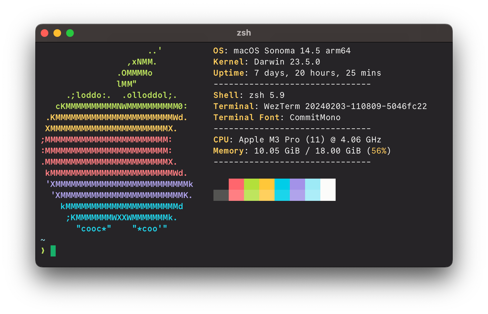

# 0x96f Terminal Theme

A simple and pleasant dark terminal theme

## Screenshot



## [Kitty](https://sw.kovidgoyal.net/kitty/)

1. Download and move `kitty/0x96f.conf` to `~/.config/kitty`.
2. Open `~/.config/kitty/kitty.conf` and import the theme by adding `include ./0x96f.conf`.
3. Restart kitty to apply the changes.

## [Warp Terminal](https://www.warp.dev/)

1. Identify the correct theme directory for your operating system:

```bash
# macOS
WARP_THEMES_DIR="$HOME/.warp/themes"
# Linux
WARP_THEMES_DIR="${XDG_DATA_HOME:-$HOME/.local/share}/warp-terminal/themes"
```

2. Move the `warp/0x96f.yaml` to your theme directory.

## Terminal.app

1. Download the theme file from the `mac-terminal` folder.
2. Open Terminal's settings via `⌘ + ,`.
3. Open the tab "Profiles", and click on the `(...)` on the lower left, select "Import".
4. Navigate to the file you just downloaded.

## [Tabby](https://github.com/Eugeny/tabby)

1. Add the contents from `tabby/0x96f.yaml` to `terminal.customColorSchemes` in `~/.config/tabby/config.yaml`.
2. Open Tabby settings and click on 'Color Scheme' to change the current color scheme.
3. In Tabby settings, click on 'Appearance' to set 'Terminal background' to 'From color scheme'.

## [Xfce Terminal](https://gitlab.xfce.org/apps/xfce4-terminal)

1. Download and move `xfce-terminal/0x96f.theme` to `~/.local/share/xfce4/terminal/colorschemes`.
2. Open Xfce Terminal and go to Preferences > Colors > Presets.
3. Choose the `0x96f` theme in the dropdown.

## [LXTerminal](https://github.com/lxde/lxterminal)

1. Browse to the `[general]` section in your active `lxterminal.conf` file and delete the lines corresponding to the color settings, starting from `bgcolor` and ending with `color_preset`.
2. Copy the contents of `lx-terminal/0x96f.conf` and paste it inside your active lxterminal.conf file.
3. Restart LXTerminal to apply the changes.

## [Black Box Terminal](https://gitlab.gnome.org/raggesilver/blackbox)

1. Download the theme file from the `blackbox` folder.
2. In Black Box terminal go to `Preferences --> Terminal`, scroll down to Theme and click on the link `Open themes folder`.
3. Copy `blockbox/0x96f.json` to the Black Box themes folder and restart Black Box.
4. Go again to `Preferences --> General`, scroll down to `Theme` and select `0x96f`.
